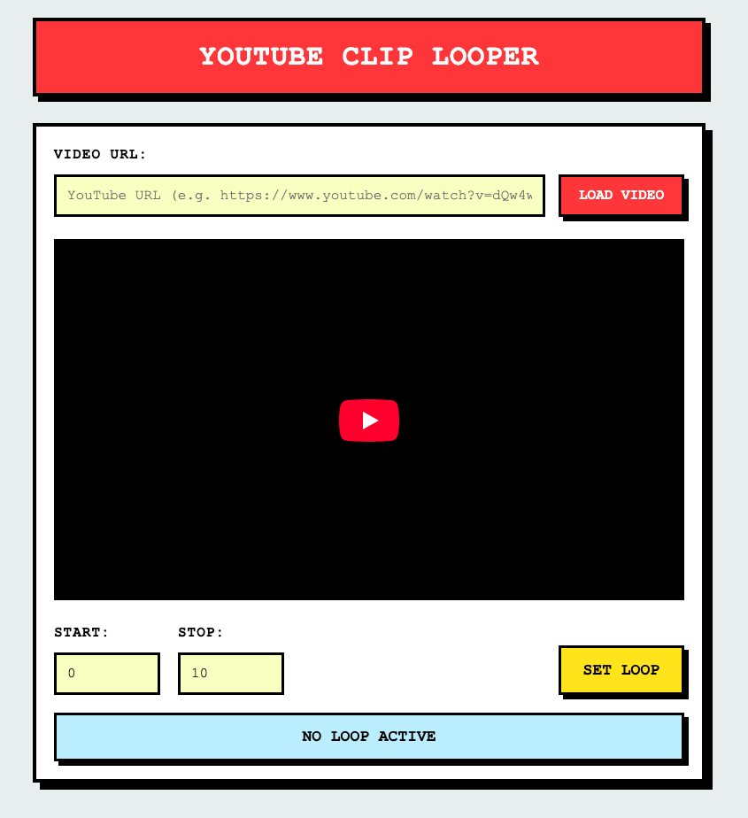

# What

A youtube player that can loop a specific part of a video.

Inspired when using this website: https://looptube.io/

It does the same thing except I found the UI to be clunky (difficult to actually define the time range).

This is perhaps a bit better but there are some UI edge cases that could be handled a bit more gracefully.

I sought out a website like this when trying to do "ear training," or trying to transcribe notes from a song (wanted to re-implement in a DAW piano roll). I wanted a way to easily play them over, and over again.

# App

https://blaircurrey.github.io/youtube-clip-looper/

